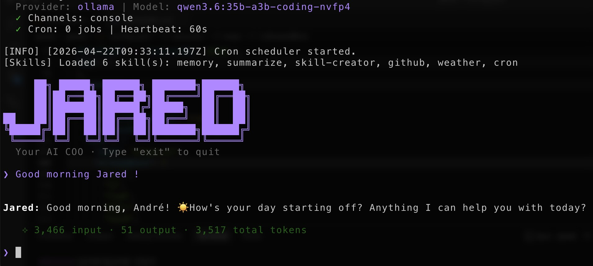

<p align="center">
  
</p>

# Jared: The AI COO

🐈 **Jared** is your AI personal assistant. Think of it like the COO (Chief Organisational Officer) of your life/company.

⚡️ Delivers core agent functionality in less than **3,000** lines of code.

📏 Real-time line count: **2,625 lines** (run `bash scripts/core_agent_lines.sh` or `bun run lines` to verify anytime)

## 🧬 Agentic as a Service (AGAAS)

Jared is an **opinionated AGAAS framework** — a ready-to-deploy AI agent that runs as a persistent service, not a one-shot chatbot.

| Traditional Chatbot         | AGAAS (Jared)                                                 |
| --------------------------- | ------------------------------------------------------------- |
| You ask → it answers → done | Always-on, always listening                                   |
| Single channel              | Multi-channel simultaneously (Telegram + Slack + Email + ...) |
| Stateless or session-scoped | Persistent SQLite memory across all channels                  |
| No initiative               | Proactive via heartbeat tasks & cron scheduling               |
| Extensions require code     | Drop a `SKILL.md` file, restart, done                         |
| Generic framework           | Opinionated: batteries included, decisions made               |

### The AGAAS Philosophy

1. **Agent, not assistant.** Jared doesn't wait passively — it monitors heartbeat tasks, triggers cron jobs, and delivers results to the right channel proactively.
2. **Service, not CLI.** Run it once, connect your channels, and Jared stays alive — handling messages from any source, remembering context across sessions.
3. **Opinionated, not configurable-to-death.** SQLite for memory (not a vector DB). Markdown for skills (not a plugin SDK). Event bus for routing (not a message queue). Every choice optimizes for simplicity and low token cost.
4. **Ultra-lightweight by design.** The entire agent core fits in < 3,000 LOC. If you can read JavaScript, you can understand and customize every line.

## Key Features

- 🪶 **Ultra-Lightweight**: Core agent logic < 3,000 lines. Just the essentials. No bloat.
- 🧠 **Bun SQLite Memory**: Uses a robust native SQL memory system with `bun:sqlite` to manage Short-Term Context, Categorized Long-Term Memory (Facts, Preferences, Rules, Summaries), and Cherry-Pick Grep (search) capabilities.
- 📉 **Native Token-Reduction Strategy**: Drastically reduces token consumption through intelligent context management and selective memory retrieval.
- 🗺️ **Universal Routing**: Jared automatically handles OpenAI-compatible endpoints (Ollama, vLLM, OpenRouter) and applies native adapter patterns for providers with custom schemas (like Google Gemini).
- 🔌 **MCP Support**: First-class Node.js implementation of Model Context Protocol for seamless tool extraction from stdio/SSE servers.
- 🌐 **Web Search & Fetch**: Built-in Brave Search integration and URL content extraction — no external dependencies.
- 🎯 **Markdown Skills**: Dynamic skill system inspired by Nanobot/OpenClaw — extend Jared by dropping a `SKILL.md` file into `src/skills/`.
- 🔒 **Exec Guard**: Three-layer security for shell commands — allowlist, blocklist, and user confirmation mode.
- 🏗️ **Workspace Sandboxing**: Restrict agent operations to a dedicated workspace directory with path traversal protection.

## 💬 Supported Channels

| Channel              | What you need                                         |
| -------------------- | ----------------------------------------------------- |
| **Terminal Console** | Nothing — works out of the box                        |
| **Telegram**         | Bot token from @BotFather                             |
| **Discord**          | Bot token + Message Content intent                    |
| **Slack**            | Bot token (`xoxb-...`) + App-Level token (`xapp-...`) |
| **WhatsApp**         | QR code scan                                          |

<details>
<summary><b>Telegram</b></summary>

**1. Create a bot**

- Open Telegram, search `@BotFather`
- Send `/newbot`, follow prompts
- Copy the token

**2. Configure**

```json
{
  "channels": {
    "telegram": {
      "enabled": true,
      "token": "YOUR_BOT_TOKEN"
    }
  }
}
```

**3. Run**

```bash
jared start
```

</details>

<details>
<summary><b>Discord</b></summary>

**1. Create a bot**

- Go to https://discord.com/developers/applications
- Create an application → Bot → Add Bot
- Copy the bot token

**2. Enable intents**

- In the Bot settings, enable **MESSAGE CONTENT INTENT**

**3. Configure**

```json
{
  "channels": {
    "discord": {
      "enabled": true,
      "token": "YOUR_BOT_TOKEN"
    }
  }
}
```

**4. Invite the bot**

- OAuth2 → URL Generator
- Scopes: `bot`
- Bot Permissions: `Send Messages`, `Read Message History`
- Open the generated invite URL and add the bot to your server

**5. Run**

```bash
jared start
```

</details>

<details>
<summary><b>Slack</b></summary>

Uses **Socket Mode** — no public URL required.

**1. Create a Slack app**

- Go to [Slack API](https://api.slack.com/apps) → **Create New App** → "From scratch"

**2. Configure the app**

- **Socket Mode**: Toggle ON → Generate an **App-Level Token** with `connections:write` scope → copy it (`xapp-...`)
- **OAuth & Permissions**: Add bot scopes: `chat:write`, `reactions:write`, `app_mentions:read`
- **Event Subscriptions**: Toggle ON → Subscribe to bot events: `message.im`, `message.channels`, `app_mention`
- **App Home**: Enable **Messages Tab**
- **Install App**: Click **Install to Workspace** → copy the **Bot Token** (`xoxb-...`)

**3. Configure**

```json
{
  "channels": {
    "slack": {
      "enabled": true,
      "botToken": "xoxb-...",
      "appToken": "xapp-..."
    }
  }
}
```

**4. Run**

```bash
jared start
```

</details>

<details>
<summary><b>WhatsApp</b></summary>

Requires **Node.js ≥18**.

**1. Configure**

```json
{
  "channels": {
    "whatsapp": {
      "enabled": true
    }
  }
}
```

**2. Run** and scan the QR code with WhatsApp → Settings → Linked Devices

```bash
jared start
```

</details>

<details>
<summary><b>Email</b></summary>

Give Jared its own email account. It polls **IMAP** for incoming mail and replies via **SMTP**.

**1. Get credentials (Gmail example)**

- Create a dedicated Gmail account (e.g. `my-jared@gmail.com`)
- Enable 2-Step Verification → Create an [App Password](https://myaccount.google.com/apppasswords)

**2. Configure**

```json
{
  "channels": {
    "email": {
      "enabled": true,
      "imapHost": "imap.gmail.com",
      "imapPort": 993,
      "imapUsername": "my-jared@gmail.com",
      "imapPassword": "your-app-password",
      "smtpHost": "smtp.gmail.com",
      "smtpPort": 587,
      "smtpUsername": "my-jared@gmail.com",
      "smtpPassword": "your-app-password",
      "fromAddress": "my-jared@gmail.com"
    }
  }
}
```

**3. Run**

```bash
jared start
```

</details>

## 📦 Installation & Setup

We recommend using **Bun** (primary) or **npm** (secondary).

1. Clone and install dependencies:

```bash
git clone adesousa/jared.git
cd jared
bun install
bun link
```

2. Initialize

```bash
jared onboard
```

3. Configure (`.jared/config.json`)

Add or merge these parts into your config (other options have defaults).

### Providers

Define your backend API endpoints and keys:

```json
{
  "providers": {
    "ollama": {
      "url": "http://localhost:11434/v1",
      "keys": [
        {
          "name": "ollama-key",
          "value": "ollama",
          "models": ["qwen3:4b-instruct", "glm-4.6:cloud"]
        }
      ]
    },
    "openai": {
      "url": "https://api.openai.com/v1",
      "keys": [
        {
          "name": "openai-key",
          "value": "sk-...",
          "models": ["chatGPT-4o"]
        }
      ]
    },
    "gemini": {
      "keys": [
        {
          "name": "gemini-key",
          "value": "AIzaSy...",
          "models": ["gemini-2.0-flash"]
        }
      ]
    }
  }
}
```

| Provider     | Purpose                                   | Get API Key                                        |
| ------------ | ----------------------------------------- | -------------------------------------------------- |
| `ollama`     | LLM (local, OpenAI-compatible)            | —                                                  |
| `openai`     | LLM (GPT direct)                          | [platform.openai.com](https://platform.openai.com) |
| `gemini`     | LLM (Gemini direct, native adapter)       | [aistudio.google.com](https://aistudio.google.com) |
| `mistral`    | LLM (Mistral direct)                      | [console.mistral.ai](https://console.mistral.ai)   |
| `openrouter` | LLM (access to all models via single API) | [openrouter.ai](https://openrouter.ai)             |

> Any OpenAI-compatible endpoint also works (vLLM, LM Studio, etc.) — just set the `url` field.

### Default Model

Set your default provider and active model:

```json
{
  "agents": {
    "defaults": {
      "provider": "ollama",
      "model": "glm-4.6:cloud",
      "thinking": false,
      "maxIterations": 15
    }
  }
}
```

| Field           | Description                                                        | Default         |
| --------------- | ------------------------------------------------------------------ | --------------- |
| `provider`      | The default LLM provider to use                                    | `ollama`        |
| `thinking`      | Enable reasoning `<think>` blocks                                  | `true`          |
| `model`         | The active model for the provider                                  | `glm-4.6:cloud` |
| `maxIterations` | Max tool-use loops per message (prevents infinite loops/runaway $) | `15`            |

### Channels

Enable and configure any channels you want Jared to run on:

```json
{
  "channels": {
    "console": { "enabled": true },
    "discord": { "enabled": true, "token": "your-bot-token" }
  }
}
```

### Security

Configure security for the `exec` tool (shell command execution):

```json
{
  "security": {
    "exec": {
      "mode": "confirm",
      "allowedBins": [
        "curl",
        "gh",
        "summarize",
        "grep",
        "cat",
        "git",
        "node",
        "bun",
        "..."
      ]
    }
  }
}
```

| Mode           | Behavior                                                              |
| -------------- | --------------------------------------------------------------------- |
| `confirm`      | Allowlist + Blocklist + Ask user approval for every command (default) |
| `allowlist`    | Allowlist + Blocklist only (no prompt)                                |
| `unrestricted` | Blocklist only (dangerous patterns always blocked)                    |

Configure workspace sandboxing to restrict all exec commands to a dedicated directory:

```json
{
  "security": {
    "restrictToWorkspace": true,
    "workspaceDir": ".jared/workspace"
  }
}
```

> When enabled, commands cannot access files outside the workspace (blocks `../` traversal and absolute paths). See [SECURITY.md](./SECURITY.md) for details.

See [SECURITY.md](./SECURITY.md) for full details.

### Web Search (Brave)

Optionally configure Brave Search for the `web_search` tool:

```json
{
  "tools": {
    "web": {
      "search": {
        "apiKey": "your-brave-api-key"
      }
    }
  }
}
```

> Get a free API key at [brave.com/search/api](https://brave.com/search/api/).

### Debug

Enable verbose debug logging:

```json
{
  "debug": true
}
```

> When `false` (default), debug-level logs are silently discarded.

### MCP (Model Context Protocol)

> The config format is compatible with Claude Desktop / Cursor. You can copy MCP server configs directly from any MCP server's README.

Jared supports [MCP](https://modelcontextprotocol.io/) — connect external tool servers and use them as native agent tools.

```json
{
  "mcp": {
    "servers": {
      "filesystem": {
        "command": "npx",
        "args": [
          "-y",
          "@modelcontextprotocol/server-filesystem",
          "/path/to/dir"
        ]
      },
      "my-remote-mcp": {
        "type": "url",
        "url": "https://example.com/mcp/sse",
        "headers": {
          "Authorization": "Bearer xxxxx"
        }
      },
      "my-streamable-mcp": {
        "type": "url",
        "transport": "streamable",
        "url": "https://example.com/mcp",
        "enabled": false
      }
    }
  }
}
```

| Mode                 | Config                                                 | Example                         |
| -------------------- | ------------------------------------------------------ | ------------------------------- |
| **Stdio**            | `command` + `args`                                     | Local process via `npx` / `uvx` |
| **HTTP/SSE**         | `type: "url"` + `url` + `headers` (optional)           | Remote endpoint                 |
| **Streamable HTTP**  | `type: "url"` + `transport: "streamable"` + `url`      | Modern remote endpoint          |

> **Pro-Tip**: You can add `"enabled": false` to any MCP server configuration to temporarily disable it and prevent its tools from injecting into Jared's context, without having to delete the config entirely.

MCP tools are automatically discovered and registered on startup. The LLM can use them alongside built-in tools — no extra configuration needed.

4. Start Jared and Chat:

```bash
jared start
```

## 🛠️ Native Tools

Jared ships with these built-in tools (no configuration needed):

| Tool                | Description                                                                               |
| ------------------- | ----------------------------------------------------------------------------------------- |
| `exec`              | Execute shell commands (secured by [Exec Guard](./SECURITY.md))                           |
| `search_memory`     | Search past conversation history by keyword                                               |
| `add_memory`        | Save a long-term memory (fact, preference, rule, summary)                                 |
| `remove_memory`     | Remove an outdated memory by ID                                                           |
| `cron`              | Schedule reminders and recurring tasks (add/list/remove, cron expressions, timezones)     |
| `message`           | Send proactive messages to the user on any channel                                        |
| `spawn`             | Spawn a background subagent for async tasks (supports configurable roles via `src/team/`) |
| `web_search`        | Search the web via Brave Search API                                                       |
| `web_fetch`         | Fetch and extract readable text from any URL                                              |
| `heartbeat`         | Manage the HEARTBEAT.md schedule (One Shot, Daily, Weekly, Monthly)                       |
| `read_skill_manual` | Read the full markdown instructions from a skill so the agent knows how to use it         |

### 🧑‍💻 The `team/` Folder (Subagent Roles)

When using the `spawn` tool to trigger background tasks, Jared typically adopts its default personality. However, for specialized tasks, you can add Markdown files to the `src/team/` folder (e.g., `web_developer.md`, `data_analyst.md`). If the `spawn` tool is called with a specific `role` parameter, the background subagent will assume that specialized system prompt instead.

**Dynamic Awareness:** Jared automatically detects files in the `src/team/` directory and injects their names into his system prompt. This gives him dynamic awareness of all available team members so he can proactively assign tasks to them without overloading context.

## 🎯 Skills

Jared uses a **Markdown-based skill system** inspired by the Nanobot/OpenClaw architecture. Skills are `SKILL.md` files with YAML frontmatter. To keep context extremely lightweight, only the `name` and `description` of each skill are loaded into the main agent prompt. If Jared needs to use a skill, he uses the `read_skill_manual` tool to dynamically load the exact instructions for that turn.

### Built-in Skills

| Skill           | Description                                    |
| --------------- | ---------------------------------------------- |
| `cron`          | Schedule reminders and recurring tasks         |
| `memory`        | Two-layer memory system with grep-based recall |
| `github`        | Interact with GitHub using the `gh` CLI        |
| `weather`       | Get weather info (no API key required)         |
| `summarize`     | Summarize URLs, files, and YouTube videos      |
| `skill-creator` | Create new skills                              |

### Adding a New Skill

1. Create a folder in `src/skills/` (e.g., `src/skills/my-skill/`)
2. Add a `SKILL.md` with YAML frontmatter and instructions:

```markdown
---
name: my-skill
description: What this skill does and when to use it.
---

# My Skill

Instructions for the agent on how to use this skill...
```

3. Restart Jared — the skill is automatically loaded!

## 💓 Heartbeat

Jared checks `.jared/HEARTBEAT.md` periodically (default: 30 seconds, configurable via `heartbeat.intervalMs`) for structured tasks. If active tasks are due, they are dispatched to the agent for processing.

```markdown
## One Shot Tasks

### 3:00 PM — Setup Repo

- Clone the repository and install dependencies

## Daily Tasks

### 9:00 AM — Morning Briefing

- Summarize schedule and emails

## Weekly Tasks

### 5:00 PM Friday — Weekly Report

- Generate the weekly wrap-up report

## Monthly Tasks

### 1st — Billing Review

- Check API usage and billing
```

The agent can manage these tasks directly using the `heartbeat` tool (actions: add, remove, list). `One Shot Tasks` are automatically removed after they are executed. You can still use the `cron` tool for simpler one-off reminders.

## CLI Reference

| Command              | Description                                                       |
| -------------------- | ----------------------------------------------------------------- |
| `jared onboard`      | Initialize the agent and generate `.jared/config.json`            |
| `jared start`        | Start Jared in interactive mode and connect configured channels   |
| `jared lines`        | Check real-time codebase size (ensuring it stays under 3,000 LOC) |
| `jared reset-memory` | Completely wipe the agent's persistent memory database            |
| `jared audit`        | Run dependency security audit (checks for known vulnerabilities)  |

Interactive mode exits: `exit`, `quit`, or `Ctrl+D`.

## 🏗️ Architecture Details

Jared utilizes a generalized event bus natively (`EventEmitter`) to bridge decoupled channel connectors (Slack, Telegram, etc.) with the core agent loop. Core configurations are mapped in `config.json`. The engine seamlessly parses incoming instructions, integrates facts via the native SQLite memory tools, executes tools (via direct JS skills or MCP abstractions), and loops until the task is complete before responding to the source channel.

## 📁 Project Structure

```text
jared/
├── .jared/
│   ├── config.json     # ⚙️ Agent configuration
│   ├── memory.db       # 🧠 SQLite persistent memory
│   ├── HEARTBEAT.md    # 💓 Recurring tasks file
│   └── workspace/      # 🔒 Exec sandbox (when restrictToWorkspace is on)
├── src/
│   ├── agent/          # 🧠 Core agent logic
│   │   ├── agent.js    #    Agent manager (spinUp orchestrator)
│   │   ├── loop.js     #    Agent loop (LLM ↔ tool execution)
│   │   ├── context.js  #    Prompt builder
│   │   ├── memory.js   #    Native bun:sqlite persistent memory
│   │   ├── skills.js   #    Dynamic SKILL.md loader
│   │   └── exec-guard.js #  Exec security (allowlist/blocklist/confirm)
│   ├── tools/          # 🔧 Built-in tool implementations
│   │   ├── exec.js     #    Shell command execution
│   │   ├── cron.js     #    Cron job scheduling
│   │   ├── memory.js   #    Memory search/add/remove
│   │   ├── message.js  #    Proactive messaging
│   │   ├── spawn.js    #    Background subagent spawning
│   │   ├── web.js      #    Web search & fetch
│   │   └── read_skill_manual.js # Loading markdown skill context
│   ├── skills/         # 🎯 Markdown-based skills (SKILL.md)
│   │   ├── cron/       #    Reminders & scheduling
│   │   ├── memory/     #    Memory management guide
│   │   ├── github/     #    GitHub CLI integration
│   │   ├── weather/    #    Weather lookups
│   │   ├── summarize/  #    URL/file summarization
│   │   └── skill-creator/ # Skill creation guide
│   ├── bus/            # 🚌 Message routing (EventEmitter)
│   ├── channels/       # 📱 Chat channel integrations
│   ├── cli/            # 🖥️ Commands (util.parseArgs)
│   ├── config/         # ⚙️ Configuration options
│   ├── cron/           # ⏰ Scheduled tasks
│   ├── heartbeat/      # 💓 HEARTBEAT.md reader & dispatcher
│   ├── mcp/            # 🔌 Model Context Protocol integrations
│   ├── providers/      # 🤖 Universal LLM router
│   ├── session/        # 💬 Conversation session tracking
│   ├── identity/       # 📜 SOUL and agent guidelines
│   ├── team/           # 🧑‍💻 Specialized Subagent identities (e.g. web_developer.md)
│   └── utils/          # 🛠️ Helper utilities
├── assets/             # 🖼️ Static assets (Jared Logo)
└── scripts/            # 📜 Operations scripts (core_agent_lines.sh)
```
